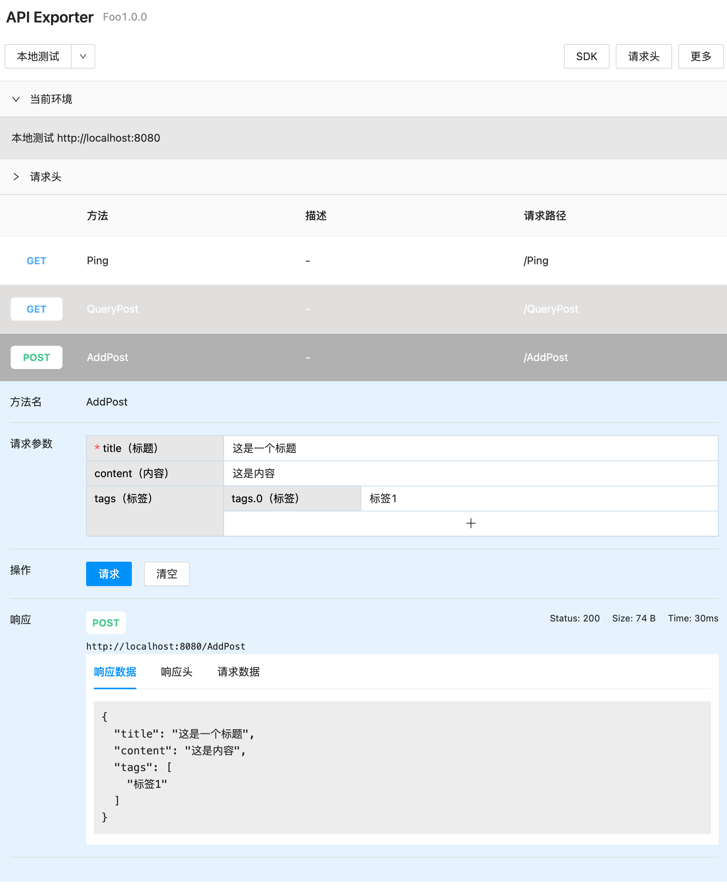

# Buck

为了降低前后端交付成本的 API 框架。

## 特性

* 支持 Service 映射路由接口；
* 方便实现 Mock 接口；
* 集成 API 调试工具，比 Swagger 更好用；  
* 支持自动生成文档；
* 支持通过命令行生成多语言 SDK。

## 安装

```
go get -u github.com/koyeo/buck
```

## 快速上手

参考 Foo 用例，[查看源码]()。

### 入口文件

> main.go

```go
package main

import (
    "github.com/gin-contrib/cors"
    "github.com/gin-gonic/gin"
    "github.com/koyeo/buck"
    "github.com/koyeo/buck/example/foo/service"
    "github.com/koyeo/buck/exporter"
)

func main() {

    // gin 跨域配置
    config := cors.DefaultConfig()
    config.AllowHeaders = []string{"*"}
    config.AllowAllOrigins = true

    // 自定义 gin 驱动
    engine := gin.Default()
    engine.Use(cors.New(config))

    // 配置 buck 实例
    api := buck.New()
    api.SetVersion("1.0.0")
    api.SetEngine(engine)
    api.AddRouter(service.NewFooRouter(new(service.FooMock)))

    // API 导出器配置
    api.SetExporter(":9090", &exporter.Options{
        Project: "Foo",
        Envs: []*exporter.Env{
            {
                Name: "本地测试",
                Host: "http://localhost:8080",
            },
        },
    })

    api.Run(":8080")
}
```

### 定义 API 路由

> service/router.go

```go
package service

import (
	"github.com/koyeo/buck"
)

func NewFooRouter(service FooService) *FooRouter {
	return &FooRouter{service: service}
}

type FooRouter struct {
	service FooService
}

func (f FooRouter) Routes() []buck.Route {
	return []buck.Route{
		{Method: buck.Get, Handler: f.service.Ping},
		{Method: buck.Get, Handler: f.service.QueryPost},
		{Handler: f.service.AddPost},
	}
}
```

### 定义服务 Interface

> service/service.go

```go
package service

import "context"

type FooService interface {
    Ping(ctx context.Context) (out string, err error)
    AddPost(ctx context.Context, in Post) (out Post, err error)
    QueryPost(ctx context.Context, in QueryPostIn) (out []Post, err error)
}

type Post struct {
    Title   string   `json:"title,omitempty" label:"标题" validator:"required"`
    Content string   `json:"content,omitempty" label:"内容"`
    Tags    []string `json:"tags,omitempty" label:"标签"`
}

type QueryPostIn struct {
    Page  int    `json:"page"`
    Limit string `json:"limit"`
    Order *Order `json:"order"`
}

type Order struct {
    Field     string
    Direction string
}
```

### 服务实现

> service/mock.go

```go
package service

import "context"

type FooMock struct {
}

func (f FooMock) Ping(ctx context.Context) (out string, err error) {
	out = "ok"
	return
}

func (f FooMock) AddPost(ctx context.Context, in Post) (out Post, err error) {
	out = in
	return
}

func (f FooMock) QueryPost(ctx context.Context, in QueryPostIn) (out []Post, err error) {
	out = append(out, Post{
		Title:   "一篇文章",
		Content: "文章内容",
		Tags:    []string{"A", "B", "C"},
	})
	return
}

```


## 服务方法

**格式说明:**

```
func (ctx context.Context [, in struct])([out interface{},] err error)
```

**入参说明:**

第一个参数必选，必须是 `context.Context` 类型，第二个参数可选，必须是一个 `struct`。

**出参说明:**

第一个参数 `out` 可选，可以为任意类型。第二个参数必选，必须是 error 类型。


**出参编码：**

如果 `out` 为 go 的基础数据类型，如 `string、int、float64` 等、或实现了 `String() `方法，则 API 返回报文采用字符串编码，否则将采用 json 编码并输出。

## Router 定义

Router 用来描述服务的 API 匹配关系，同时可以在 Router 中定义中间件、前缀等。实现 `buck.Router` 即可实现一个 `Router`。

```go
type UserRouter struct {
    service UserService
}

func (u UserRouter) Routers() []buck.Route {
    return []buck.Route{
        {
            Prefix: "/api",                                  // 定义路由分组前缀
            Middleware: SomeMiddleware,                      // 定义分组中间件
            Children: []buck.Route{
              { Handler: p.service.Register },               // 默认采用 Post 方法，Handler 方法名作为路径    
              { Method: buck.Get, Handler: p.service.Ping }, // 指定请求方法
              { Path: "/login", Handler: p.service.Login },  // 指定请求路径
            },
        }    
    }   
}
```

## 入参标签

| 标签        | 用途                                   |
| --------- | ------------------------------------ |
| label     | 用于备注字段在文档中的显示名称                      |
| validator | 用于标注字段的校验规则，如 `validator="required"` |

## 文档工具截图 



## Authors 关于作者

- [**koyeo**](https://github.com/koeyo) - *Initial work* 

查看更多关于这个项目的贡献者，请阅读 [contributors](https://gist.github.com/wangyan/6e8021667fe7f2082d153bed2d764618#)。

## License 授权协议

这个项目 MIT 协议， 请点击 [LICENSE](https://choosealicense.com/licenses/mit) 了解更多细节。